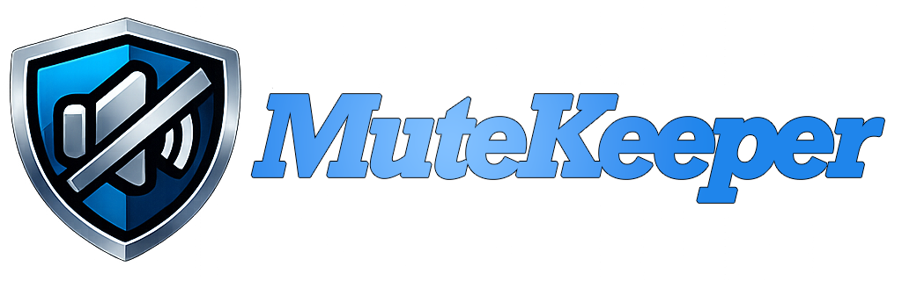

{ .hero-logo }

**DAW の再生状態に連動する、自動ミュート・ボリューム制御プラグイン**

[ダウンロード (macOS) :material-apple:](https://github.com/kawato3/MuteKeeper/releases/download/v1.0.0/MuteKeeper-1.0.0-macOS.dmg){ .md-button .md-button--primary }

:material-translate: **[English](./en/)** | 日本語

---

## MuteKeeper とは { #about }

MuteKeeper は、DAW の再生状態 — **停止**・**再生**・**録音** — に応じて、自動的にオーディオ信号のレベルを制御する **無料** の VST3 プラグインです。

ライブステージでの PA オペレーション、スタジオでのトークバックマイク、リバーブの自動オン・オフなど、「DAW の状態が変わったらミュート状態音量を自動で切り替えたい」というニーズに応えます。DAW の状態に連動した自動ボリューム制御は、オペレーションの負担を大幅に軽減します。

単なるミュートの ON/OFF だけでなく、**任意の dB 値による段階的なボリューム制御**と、**設定可能なフェードタイム**による滑らかなトランジションを実現します。

## 特徴 { #features }

:material-volume-high: **状態別ボリューム制御**
:   停止・再生・録音それぞれに独立したボリュームを設定。Mute から +10 dB まで自由に。

:material-shield-check: **透明なオーディオ**
:   0 dB 時はビットパーフェクトなパススルー。音質への影響はゼロ。

:material-swap-horizontal: **スムーズなフェード**
:   0〜5000 ms のフェードタイムを設定可能。知覚カーブ（パーセプチュアルカーブ）対応で自然な音量変化。

:material-record-rec: **録音モード**
:   再生ボリュームと連動、または独立した録音ボリュームを設定可能。

:material-palette: **ダークテーマ UI**
:   ステージサイドでも眩しくないダークテーマ。100% / 150% / 200% のスケール切り替え。

:material-auto-fix: **DAW オートメーション完全対応**
:   すべてのパラメータを DAW のオートメーションから制御可能。

## 使い方・ユースケース { #use-cases }

### :material-microphone: トークバック マイクの自動制御

トークバック マイクのチャンネルに MuteKeeper をインサートします。

- **停止中**: 0 dB（マイク ON）
- **再生・録音中**: Mute（マイク OFF）

DAW を再生・録音すると自動的にトークバックが切れ、停止すると復帰します。
必要であれば、録音時だけミュートし、再生時はトークバックを生かして会話をしながら聞く、ということも可能です。

### :material-reverb: リバーブ / エフェクトの自動切り替え

リバーブのセンド チャンネルで、リバーブの直前に MuteKeeper を配置します。

- **再生中**: 0 dB（リバーブ ON）
- **停止中**: -20 dB（リバーブを薄く残す）、または Mute

本番中はフルにリバーブをかけ、トーク中は自動的にリバーブを絞る — そんなオペレーションが自動化できます。

### :material-click: クリック トラックのオン・オフ

録音中はクリック トラックを生かして、聞き直す際にはミュートする。応用できるパターンはたくさんあります。

## ダウンロード { #download }

### macOS

[MuteKeeper v1.0.0 をダウンロード :material-download:](https://github.com/kawato3/MuteKeeper/releases/download/v1.0.0/MuteKeeper-1.0.0-macOS.dmg){ .md-button .md-button--primary }

DMG を開き、インストーラーを実行してください。
VST3 プラグインは `/Library/Audio/Plug-Ins/VST3/` にインストールされます。

### Windows

Windows 版は現在開発中です。(TBD)

## 技術仕様 { #specs }

| 項目 | 仕様 |
|------|------|
| プラグイン形式 | VST3 |
| 対応 OS | macOS (Intel / Apple Silicon) |
| ボリューム範囲 | Mute 〜 +10 dB |
| フェードタイム | 0 〜 5000 ms（知覚カーブ対応） |
| レイテンシー | 0 サンプル |
| ライセンス | MIT（無料） |

## Muteomatic をお使いの方へ { #comparison }

MuteKeeper は、[Sound Radix](https://www.soundradix.com/) 社の無料プラグイン **[Muteomatic](https://www.soundradix.com/products/mute-o-matic/)** （Mute-o-Matic）にインスパイアされて開発されました。

Muteomatic は DAW の再生状態に連動したミュート制御を実現する素晴らしいプラグインであり、長年にわたり多くのエンジニアに愛用されています。**ミュートの ON/OFF 制御が目的であれば、Muteomatic は今でも最適な選択肢のひとつです。** 私たちは Muteomatic が大好きです。

MuteKeeper は、Muteomatic の発想に最大限の敬意を払いつつ、以下の機能を追加することで、より幅広いユースケースに対応しています：

| | Muteomatic | MuteKeeper |
|---|:---:|:---:|
| 段階的なボリューム制御 (Mute 〜 +10 dB) | — | :material-check: |
| 設定可能なフェードタイム (0〜5000 ms) | — | :material-check: |
| 録音状態の独立ボリューム制御 | — | :material-check: |
| リサイズ対応 UI | — | :material-check: |

「ミュートだけで十分」という方には [Muteomatic](https://www.soundradix.com/products/mute-o-matic/) を、「もう少し細かく制御したい」という方には MuteKeeper をおすすめします。

## サポート { #support }

バグ報告や機能リクエストは [GitHub Issues](https://github.com/kawato3/MuteKeeper/issues) でお受けしています。

---

MuteKeeper は無料でお使いいただけますが、開発の励みになりますので、気に入っていただけたらコーヒーを一杯おごってください :coffee:

[:material-coffee: Buy Me a Coffee](https://buymeacoffee.com/kawato3){ .md-button }

## ライセンス { #license }

MuteKeeper は [MIT License](https://github.com/kawato3/MuteKeeper/blob/main/LICENSE) のもとで公開されています。個人利用・商用利用を問わず、自由にご利用いただけます。
