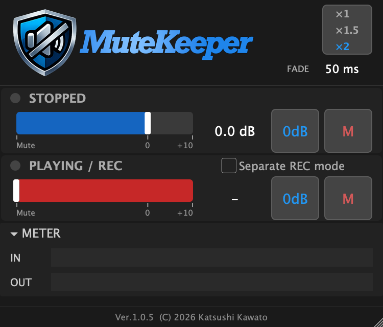
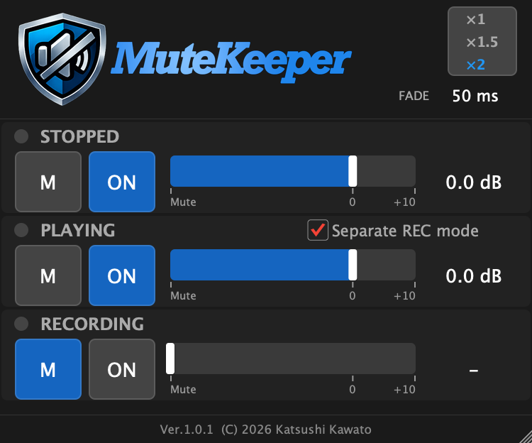
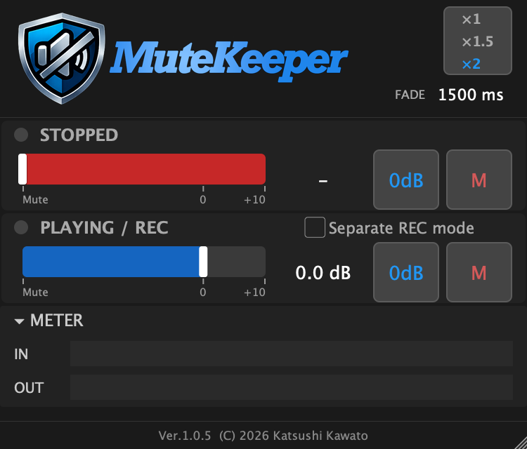
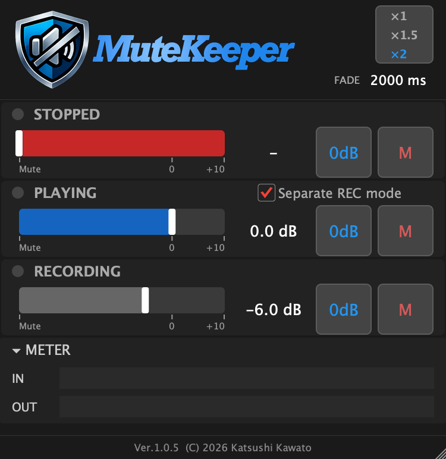
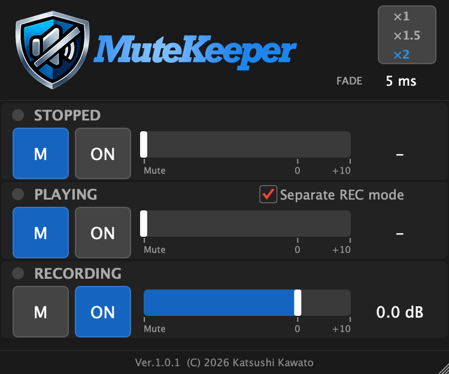

# ユーザーマニュアル

MuteKeeper の画面構成と、具体的なユースケースを紹介します。
MuteKeeper の概要やダウンロードについては[ホーム](index.md)をご覧ください。

---

## 画面の見かた { #ui-overview }

MuteKeeper の画面は、大きく分けて **ヘッダー**、**ボリューム コントロール**（2〜3 セクション）、**レベルメーター**、**フッター** で構成されています。

{ .screenshot }

### ヘッダー { #header }

画面上部のエリアです。

- **左側**: MuteKeeper のロゴ
- **中央〜右側**: **FADE** ラベルとフェードタイムの値（例: `50 ms`）。ドラッグで上下に調整でき、ダブルクリックで直接数値を入力できます。設定範囲は 0〜5000 ms です
- **右端**: **スケールボタン**（`100%` / `150%` / `200%`）。クリックで切り替わり、画面の表示倍率が変わります

### ボリューム コントロール { #volume-controls }

各トランスポート状態（停止・再生・録音）に対応するボリューム コントロールが縦に並んでいます。各コントロールの構成は共通です:

- **LED インジケーター**: 丸い点灯表示。現在アクティブな状態のものが光ります（停止/再生 = 緑、録音 = 赤）
- **状態タイトル**: `STOPPED`、`PLAYING / REC`、`RECORDING` など
- **M ボタン**: ミュート（-100 dB）に設定します。青くハイライトされている時はミュート状態です
- **ON ボタン**: 0 dB（原音そのまま）に設定します。青くハイライトされている時は 0 dB です
- **スライダー**: 水平方向にドラッグしてボリュームを調整します。範囲は Mute〜+10 dB。0 dB 付近でスナップ（吸着）します
- **dB 値ラベル**: 現在のボリューム値を表示します。クリックして数値を直接入力したり、上下にドラッグして微調整できます

#### STOPPED（停止中）

DAW が停止している時に適用されるボリュームです。

#### PLAYING / REC（再生/録音中）

DAW が再生中または録音中に適用されるボリュームです。デフォルトでは再生と録音で同じ設定が共有されます。

#### Separate REC mode チェックボックス { #separate-rec }

PLAYING セクションの右端にあるチェックボックスです。

- **OFF（デフォルト）**: 再生と録音は同じボリュームを共有。タイトルは `PLAYING / REC` と表示されます
- **ON**: RECORDING セクションが画面下部に追加表示され、録音時のボリュームを個別に設定できます。タイトルはそれぞれ `PLAYING`、`RECORDING` になります

### レベルメーター { #meter }

ボリューム コントロールの下に配置された、折りたたみ式の IN/OUT レベルメーターです。

- **▾ METER** ヘッダーをクリックすると表示・非表示を切り替えられます
- **IN**: MuteKeeper に入力される信号レベル（ゲイン適用前）
- **OUT**: MuteKeeper から出力される信号レベル（ゲイン適用後）

信号が来ているか、ボリューム設定が正しく適用されているかを視覚的に確認できます。表示状態は DAW プロジェクトに保存されます。

### フッター { #footer }

画面下部にバージョンとコピーライトが表示されます。

### デフォルト設定 { #defaults }

| パラメータ | デフォルト値 |
|-----------|------------|
| Stopped Volume | 0 dB |
| Playing Volume | Mute |
| Recording Volume | 0 dB |
| Recording Linked | ON（PLAYING と共有） |
| Fade Time | 50 ms |
| Meter Visible | ON（表示） |
| UI Scale | 100% |

---

## フェードタイム — MuteKeeper の鍵 { #fade-time }

MuteKeeper の大きな特長のひとつが、**設定可能なフェードタイム**です。DAW のトランスポート状態が変わった時に、ボリュームが瞬時に切り替わるのではなく、指定した時間をかけて滑らかに移行します。

フェードには知覚カーブ（パーセプチュアルカーブ）が適用されるため、聴感的に自然な音量変化になります。

用途に合わせてフェードタイムを調整してみてください:

| フェードタイム | 用途の例 |
|-------------|---------|
| 0 ms | 完全に瞬時の切り替え（まれにクリックノイズが出ることがあります） |
| 3〜5 ms | クリックトラックなど、立ち上がりが重要な音 |
| 50 ms | デフォルト値。多くの用途で十分にスムーズ |
| 500〜2000 ms | リバーブやエフェクトの自然なフェードイン・アウト |
| 〜5000 ms | ドラマチックなフェード演出 |

!!! tip "フェードタイムを積極的に活用しましょう"
    フェードタイムは MuteKeeper を単なるミュート スイッチ以上のツールにする機能です。ユースケースごとに最適な値を見つけてみてください。

---

## ユースケース 1: トークバック マイクの制御 { #talkback }

### やりたいこと

レコーディング セッションで、ブースへの指示用にトークバック マイクを使っている場合に、DAW の再生・録音中はマイクを自動的にミュートし、停止するとすぐに話せるようにしたい。

### DAW での準備

1. DAW にトークバック マイク用のチャンネル（トラック）を作成します
2. そのチャンネルの **インサート** に MuteKeeper を配置します

### 基本編: 再生・録音中はミュート { #talkback-basic }

もっともシンプルな設定です。DAW が動いている間はマイクを切り、止まったら自動的に復帰します。

**MuteKeeper の設定:**

- **STOPPED**: 0 dB（**ON** ボタンを押す）
- **PLAYING / REC**: Mute（**M** ボタンを押す）
- **Fade Time**: 50 ms（デフォルトのままで OK）

{ .screenshot }

**動作**: DAW の再生ボタンや録音ボタンを押すとマイクがミュートされ、停止するとすぐに話せるようになります。

### 応用編: 再生中は話せて、録音中だけミュート { #talkback-advanced }

録ったテイクを聞きながらブースと会話したい場合。再生中はマイクを生かしておき、録音中だけミュートします。

**MuteKeeper の設定:**

1. **Separate REC mode** チェックボックスを **ON** にします
2. **STOPPED**: 0 dB
3. **PLAYING**: 0 dB
4. **RECORDING**: Mute
5. **Fade Time**: 50 ms

{ .screenshot }

**動作**: 停止中・再生中はマイクが通じていて会話できます。録音ボタンを押した瞬間にマイクがミュートされ、録音を止めると復帰します。

---

## ユースケース 2: リバーブ / エフェクトの制御 { #reverb }

### やりたいこと

ボーカルにリバーブを掛けている場合、オケを流して歌っている時はリバーブを掛けたいけど、停止中（しゃべっている間）はリバーブを切りたい。レコーディングでもライブでもよくあるケースです。

### DAW での準備

1. リバーブの **センド（AUX / バス）チャンネル** で、リバーブ プラグインの **直前** に MuteKeeper を配置します

!!! note "なぜリバーブの「直前」？"
    MuteKeeper はリバーブへの「入力信号」を制御します。リバーブの直前に配置することで、停止時にリバーブへの入力がフェードアウトし、リバーブ テイルが自然に消えていきます。

### 基本編: 再生中だけリバーブ ON { #reverb-basic }

**MuteKeeper の設定:**

- **STOPPED**: Mute（**M** ボタンを押す）
- **PLAYING / REC**: 0 dB（**ON** ボタンを押す）
- **Fade Time**: 1500 ms

{ .screenshot }

**動作**: DAW を再生すると 1.5 秒かけてリバーブが自然に掛かり始めます。停止すると同じく 1.5 秒かけてフェードアウトします。

!!! tip "フェードタイムは 1〜2 秒がおすすめ"
    リバーブの場合、フェードタイムを長めに設定するのがポイントです。短すぎると切り替わりが唐突に感じられます。1000〜2000 ms を試してみてください。

### 応用編: 録音中はリバーブ薄め、再生中はフル { #reverb-advanced }

録音中はリバーブを薄めにして歌いやすくし、プレイバック時にはフル量で確認したい。停止中はリバーブ OFF。

**MuteKeeper の設定:**

1. **Separate REC mode** チェックボックスを **ON** にします
2. **STOPPED**: Mute
3. **PLAYING**: 0 dB
4. **RECORDING**: -6.0 dB
5. **Fade Time**: 2000 ms

{ .screenshot }

**動作**: 停止中はリバーブ OFF。録音を始めると 2 秒かけてリバーブが -6 dB（やや薄め）まで掛かります。プレイバックに切り替えると 2 秒かけてフルの 0 dB まで上がります。

---

## ユースケース 3: クリック トラックのオン・オフ { #click }

### やりたいこと

DAW 内蔵のクリックではなく、別途クリック用のチャンネルがある場合に、録音中はクリックを鳴らし、確認のプレイバック時は鳴らさないようにしたい。

### DAW での準備

1. クリック音源が配置されたチャンネルの **インサート** に MuteKeeper を配置します

### 設定例: 録音中だけクリック ON { #click-basic }

**MuteKeeper の設定:**

1. **Separate REC mode** チェックボックスを **ON** にします
2. **STOPPED**: Mute
3. **PLAYING**: Mute
4. **RECORDING**: 0 dB（**ON** ボタンを押す）
5. **Fade Time**: **5 ms**

{ .screenshot }

**動作**: 録音中だけクリックが聞こえ、再生や停止に切り替えるとほぼ瞬時にミュートされます。

!!! warning "フェードタイムは 3〜5 ms を推奨"
    クリック トラックは立ち上がりが重要な音です。フェードタイムは極力短くしましょう。ただし **0 ms だと切り替え時にノイズが出ることがあります**ので、3〜5 ms 程度に設定するのが安全です。

!!! tip "プレイバック時にクリックを薄っすら鳴らす"
    PLAYING のボリュームを Mute ではなく -20 dB 程度に設定すると、プレイバック時にクリックが薄く聞こえるようになります。テンポ確認しながら聞き返したい場合に便利です。

---

## パラメータ一覧 { #parameters }

| パラメータ | 範囲 | デフォルト | 説明 |
|-----------|------|----------|------|
| Stopped Volume | Mute 〜 +10 dB | 0 dB | DAW 停止中のボリューム |
| Playing Volume | Mute 〜 +10 dB | Mute | DAW 再生中のボリューム |
| Recording Volume | Mute 〜 +10 dB | 0 dB | DAW 録音中のボリューム |
| Recording Linked | ON / OFF | ON | OFF で録音ボリュームを個別設定 |
| Fade Time | 0 〜 5000 ms | 50 ms | 状態切り替え時のフェード時間 |
| Meter Visible | ON / OFF | ON | IN/OUT レベルメーターの表示 |
| UI Scale | 100% / 150% / 200% | 100% | 画面の表示倍率 |

---

## Tips { #tips }

- **0 dB はビットパーフェクト**: ボリュームが 0 dB の時は信号処理を一切行わず、入力をそのまま出力します。音質劣化はゼロです
- **0 dB スナップ**: スライダーを操作する際、0 dB 付近（±1 dB 以内）で自動的に 0 dB にスナップ（吸着）します
- **ミュート スナップ**: -75 dB 以下の値は自動的に Mute（-100 dB）にスナップします
- **DAW オートメーション**: すべてのパラメータは DAW のオートメーション レーンから制御できます。フェードタイムやボリューム値を楽曲中で変化させることも可能です
- **マルチチャンネル対応**: モノラル、ステレオだけでなく、サラウンド（5.1 / 7.1 等）を含む任意のチャンネル構成で動作します。すべてのチャンネルに均一にボリュームが適用されます
- **レイテンシー ゼロ**: MuteKeeper はレイテンシーを追加しません（0 サンプル）

---

## 既知の制限 { #known-limitations }

- **Fender Studio Pro (CLAP)**: macOS 版は CLAP プラグインを正しく扱えないことがあります（v8.0.2 で確認）。VST3 版をお使いください
- **REAPER (CLAP)**: REAPER の CLAP ホスト実装が録音状態フラグを送信しないため、録音中も "Playing" として動作します。録音状態の区別が必要な場合は、VST3 版をお使いください
- **GarageBand (AUv3)**: オーディオトラックでモニタリングが OFF の場合、トランスポート停止を検知できないことがあります。モニタリングを ON にすることで回避できます
- **AUv3 全般**: UI スケール切り替え後、ホストのプラグインウィンドウサイズが追従しない場合があります。プラグインウィンドウを開き直すことで反映されます
